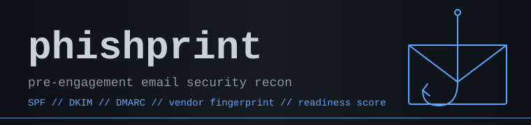

<p align="center">
  
</p>

Pre-engagement email security reconnaissance for offensive security operators.

**Author:** SkyzFallin

## What It Does

phishprint fingerprints a target organization's email security posture before
you launch a phishing campaign. It reads only public DNS — no SMTP probes,
no banner grabs, no traffic against the target's mail servers — and produces
a JSON-first analysis you can pipe into your campaign tooling.

In one run it will:

- Resolve the full MX chain, IPs, and ASN ownership.
- Parse the SPF record, recursively expand `include:` chains, and count
  DNS-lookup mechanisms against the RFC 7208 ten-lookup limit.
- Probe a wordlist of common DKIM selectors and report which keys are
  observable.
- Parse DMARC (policy, subdomain policy, alignment, coverage, reporting).
- Check BIMI, MTA-STS, and TLS-RPT presence.
- Fingerprint the mail security vendor(s) protecting the target —
  Proofpoint, Mimecast, M365 Defender, Google Workspace, Cisco IronPort,
  Barracuda, Sophos, Trend Micro, Fortinet, MailRoute, Zoho, and the
  major transactional senders.
- Detect material **bypass conditions** — DMARC absent or `p=none`,
  SPF softfail/neutral/missing-`all`, SPF lookup overflow, subdomain
  policy gaps, hybrid-mail signals.
- Compute a 0–100 **readiness score** with a categorical band
  (Hardened / Moderate / Permissive / Open).
- Recommend sending-side infrastructure decisions: domain age, lookalike
  vs. fresh, sender auth requirements, TLS posture, and vendor-specific
  notes.

Cuts pre-engagement DNS-and-headers recon from ~30 minutes of manual
`dig` work to under a minute.

## Quick Start

Install from a clone (not yet on PyPI):

```bash
git clone https://github.com/SkyzFallin/phishprint
cd phishprint
pipx install .
```

Or install directly from GitHub without cloning:

```bash
pipx install git+https://github.com/SkyzFallin/phishprint
```

Then:

```bash
phishprint example.com                      # JSON to stdout
phishprint example.com --score              # 0-100 integer, for piping
phishprint example.com -o report.md         # operator-readable Markdown
phishprint example.com --json scan.json -o report.md
phishprint example.com --doh                # DNS-over-HTTPS via 1.1.1.1
phishprint example.com --resolver 9.9.9.9   # specific resolver
```

## Output

| Format | Flag | Use |
| --- | --- | --- |
| JSON (stdout) | _default_ | Feed downstream tools (campaign config generators, infra provisioners). |
| Markdown report | `-o report.md` | Operator-readable; tables for DNS records, vendor evidence, findings, recommendations. |
| Score-only | `--score` | Single integer for shell pipelines and dashboards. |
| JSON to file | `--json scan.json` | Same JSON as stdout, written to a file (combine with `-o`). |

### Readiness bands

| Band | Score | Meaning |
| --- | --- | --- |
| Hardened | 75–100 | Strict DMARC, healthy SPF, heavy-inspection vendor. Plan a slow burn or pivot to a sister domain. |
| Moderate | 50–74 | Enforcement present but with gaps you can work around. |
| Permissive | 25–49 | Posture meaningfully relaxed; lookalikes are viable. |
| Open | 0–24 | Bare domain spoofing is on the table. |

## Usage Options

```
phishprint <domain> [flags]

Flags:
  -o, --output <path>        Write Markdown report to path
      --json <path>          Write JSON to path (in addition to stdout)
      --score                Output only the readiness score (0-100)
      --selectors <file>     Custom DKIM selector wordlist
      --resolver <ip>        Use specific DNS resolver
      --doh                  Use DNS-over-HTTPS (Cloudflare 1.1.1.1)
      --timeout <sec>        Per-query timeout (default: 5)
      --no-asn               Skip ASN enrichment of MX IPs
  -v, --verbose              Show DNS query trace
      --no-color             Disable ANSI color
      --version              Show version
```

## Notes

- **Operate from the jumpbox.** Run on Kali (or whichever box owns your
  egress) so DNS queries originate there — not from your home IP via the
  resolver logs of whatever DNS service you happen to be using locally.
- **DNS-only in v0.1.** No SMTP probes. No HTTP fetches against target
  infrastructure. The only outbound HTTP is the optional Cloudflare DoH
  endpoint when `--doh` is passed.
- **DKIM observability is a hint, not proof.** Absence of selectors in the
  default wordlist means we couldn't observe a key — not that the domain
  doesn't sign. Pass `--selectors` with a custom list when you have intel
  on the target's selector naming.
- **Vendor signatures live in YAML.** See
  [`phishprint/fingerprint/signatures.yaml`](phishprint/fingerprint/signatures.yaml).
  This file rots fastest — patches welcome.
- **Tests use canned DNS fixtures.** No live network in the suite; running
  `pytest` is offline-safe.

## Changelog

- **v0.1.0** — MVP. MX/SPF/DKIM/DMARC/BIMI/MTA-STS/TLS-RPT, vendor
  fingerprinting (MX hostname + SPF includes + ASN org), bypass detection,
  readiness score, Markdown + JSON output, Typer CLI.

## Roadmap

- **v0.2** — ASN-based vendor fallback weighting, vendor-specific
  recommendation snippets fully populated, batch mode (`-f domains.txt`).
- **v0.3** — Lookalike domain availability check, historical posture
  tracking in `~/.phishprint/history.db`, Gophish-ready sending-profile stub.
- **v0.4** — Header-analysis mode (paste a received email, get a posture
  view of the actual delivery path); Censys/Shodan integration for sender
  infra recon.

## Credits

Built by SkyzFallin. Vendor signatures derived from publicly observed
hostname patterns and the operator community's collective experience with
each gateway.

## Project Hygiene

- Code style: `ruff` (line length 100, target Py 3.11).
- Tests: `pytest`. All DNS in tests is canned via `FakeResolver` — never
  live.
- Vendor signatures are data-driven (YAML) so they can be updated without
  touching code.
- `pyproject.toml`-based packaging; installable via `pipx`.

See [AUDIT.md](AUDIT.md) for the standing audit of code quality, security,
repo hygiene, and the feature backlog.

## Authorized Use Only

phishprint is a tool for authorized red team and social engineering
engagements. All reconnaissance it performs is passive DNS — no active
probing of target infrastructure. Operators are responsible for their own
scope and authorization. Do not run this against domains you are not
authorized to assess.

## License

[MIT](LICENSE).
